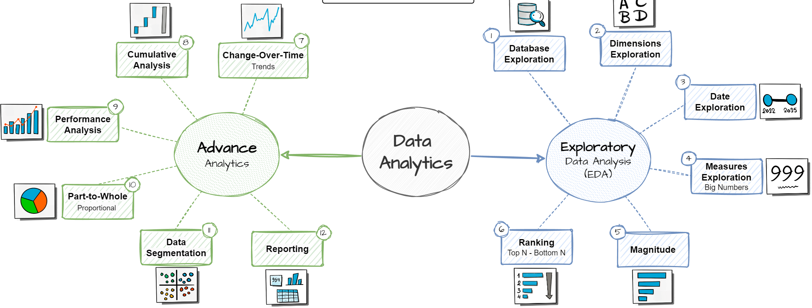

# SQL Data Analytics Project

This project demonstrates **Data Analytics** workflows using datasets (tables) extracted from a **previous Data Warehouse project**.  
It is a continuation of that project (👉 [https://github.com/josphat-19/sql-data-warehouse-project]) and focuses on applying **Exploratory Data Analysis (EDA)** and **Advanced Analytics** techniques directly in **SQL Server 2022** using **SSMS 21**.

---

## 📊 Project Overview

The project builds on top of an **ETL-based Data Warehouse**, where fact and dimension tables were created.  
Using this data foundation, I applied analytics techniques to answer business questions, explore patterns, and generate meaningful reports.

The analytics is divided into two key phases:

### 1. Exploratory Data Analysis (EDA)
EDA focuses on discovering the structure and trends within the data:
- **Database Exploration** – Initial inspection of tables and relationships.  
- **Dimensions Exploration** – Analyzing categorical data (e.g., product categories, regions).  
- **Date Exploration** – Understanding seasonality, periods, and time-based behaviors.  
- **Measures Exploration** – Evaluating key numeric measures (e.g., revenue, sales, quantities).  
- **Magnitude** – Identifying biggest contributors.  
- **Ranking** – Top-N / Bottom-N analysis (best/worst performers).

### 2. Advanced Analytics
Advanced analytics builds on EDA to generate deeper business insights:
- **Change-Over-Time Trends** – Analyzing trends and growth patterns.  
- **Cumulative Analysis** – Tracking performance over time with accumulative metrics.  
- **Performance Analysis** – Measuring KPIs, efficiency, and effectiveness.  
- **Part-to-Whole Analysis** – Studying proportions and contributions.  
- **Data Segmentation** – Grouping customers/products for better targeting.  
- **Reporting** – Delivering results in structured reports.  

---

## 🏗️ Project Workflow

1. **Data Source**  
   - Extracted fact and dimension tables from the previous **Data Warehouse project**.  
   - Used SQL queries for data cleaning, joining, and transformation.

2. **Exploration**  
   - Applied EDA techniques to understand distributions, relationships, and patterns.  

3. **Analytics & Insights**  
   - Performed cumulative, ranking, and segmentation analysis.  
   - Conducted performance and proportional (part-to-whole) analytics.  

4. **Reporting**  
   - Generated tabular and query-based reports directly in SQL Server.  

---

## 🛠️ Tech Stack

- **SQL Server 2022** – Database engine.  
- **SQL Server Management Studio (SSMS) 21** – Main development environment.  
- **Data Warehouse** – Source of fact & dimension tables.  

---

## 📌 Key Learnings

- Importance of **dimensions vs measures** in analytics.  
- How to bridge a **Data Warehouse project** with an **Analytics project**.  
- Structured approach: **EDA ➝ Advanced Analytics ➝ Reporting**.  
- Ability to generate **business-ready insights** from raw warehouse data.  

---

## 📂 Repository Structure

- ├── datasets/ # Sample datasets (from Data Warehouse in csv) & db backup file
- ├── docs/ # Diagrams & reference charts (e.g., roadmap)
- ├── scripts/ # SQL scripts for EDA & Analytics
- ├── reports/ # Query-based results & outputs
- ├── LICENSE/ # MIT
- └── README.md # Project documentation
